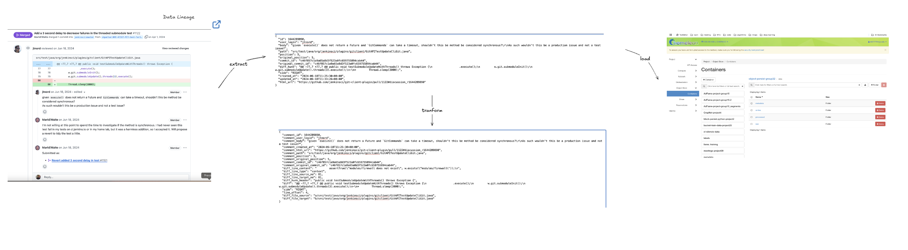

## Title: Github Bot for Code Review Assistance

### Goal
To develop a bot that is able to create context-aware review comments on Github Pull Requests.

### Value Proposition
Jenkins, valued as a leading open-source automation server, thrives with the support of a large open source community. Naturally, the maintainers deal with a large number of Pull Requests and in their years of maintaining the large, old codebase, they have defined a structured process to review PRs. In this extensive [document](https://wiki.jenkins.io/display/JENKINS/Beginners+Guide+to+Contributing#BeginnersGuidetoContributing-Areyouinterestedinwritingcode%3F), they mention some of the things they check each PR with: 
- Checkstyle: analyzes Java code for coding standard violations
- Code Coverage: enforces users to improve unit test coverage by writing unit test for their contribution
- ESLint: static code analysis for Javascript code
- SpotBugs: Uses static analysis to look for bugs in Java code

Currently, the standard code review process on GitHub (without our bot) involves:
* Human reviewers (peers, team leads, maintainers) are assigned or volunteer to review.
* Reviewers manually read through the code changes (the diff).
* They rely on their own knowledge, experience, memory of the codebase, and established team guidelines to identify issues ranging from simple typos and style violations to complex logical errors, security vulnerabilities, and architectural concerns.
* Reviewers manually write comments on specific lines or provide overall feedback.
* This process is often asynchronous, potentially leading to significant delays depending on reviewer availability.
* The quality and thoroughness of the review depend heavily on the individual reviewer's diligence, current workload, and familiarity with the specific code area. Repetitive identification of common issues consumes significant reviewer time.

With our bot, we aim to:
1. Reduce reviewer load: automate the detection of common issues and potential pitfalls, freeing reviewers to focus on higher level architectural design concerns.
2. Faster feedback loop for developers: Developers would receive an initial feedback on their PR almost instantly, thus removing the wait that can vary from a couple of hours to days depending on the reviewer’s availability
3. Consistency: This bot aims to introduce a consistent reviewing pattern to the entire codebase, and that is often an ignored factor while developing source code with multiple contributors. Style and procedure of reviewing varies with each reviewer and that can lead to increased time to merge.

Metric to be judged on:
1. Location awareness: 
   1. Precision: Of all the locations the bot commented on, what fraction were actual human comment locations in the test set?
   2. Recall: Of all the actual human comment locations in the test set, what fraction did the bot find?
2. Semantic Similarity:  **BERTScore:** Computes similarity using contextual embeddings from BERT, focusing on semantic meaning rather than just exact word matches.

### Contributors

| Name               | Responsible for                                              | Link to their commits in this repo |
|--------------------|--------------------------------------------------------------|------------------------------------|
| All team members   | Overall design of ML System, Value Proposition, Decisions around Content Extraction at Inference, Custom dataset, Model selection, UI/UX of the bot, Extra difficulty components |                                    |
|  Nidhi Donuru     | Model Serving & Monitoring                                              |    https://github.com/BugBeak/MLOps/commits/main/?author=nidhiid                                |
| Khushi Sharma      | Model Training and Experimentation                           |          https://github.com/BugBeak/MLOps/commits/main/?author=BugBeak                            |
|Rishabh Budhouliya       | Data Pipeline                                       |    https://github.com/BugBeak/MLOps/commits/main/?author=rishabhBudhouliya                                 |
|   Riya Patil       | Continuous X Pipeline                                                |      https://github.com/BugBeak/MLOps/commits/main/?author=Riyap30                |               |

---
### System Diagram

### Summary of outside materials

|            | How it was created                                           | Conditions of use                                            |
|------------|--------------------------------------------------------------|--------------------------------------------------------------|
| Code LLaMA | Code LLaMA                                                   | 1. **No Direct Model Hosting**: You can’t redistribute the raw model weights as-is; instead, you’re encouraged to use them in applications or fine-tune them, adhering to the license terms. 2. **Disclosure**: If deploying Code LLaMA in a product, inform users it’s AI-generated content where appropriate (e.g., watermarking via tools like SynthID, if applicable). 3. **Governance**: Establish accountability mechanisms (e.g., logging usage, monitoring outputs) to address misuse or errors. 4. **Safety Measures**: Implement safeguards like human oversight or filtering to prevent unintended outcomes, especially since Code LLaMA can generate executable code. |

### Summary of infrastructure requirements

| Stage                            | Requirement                  | Quantity | Floating IPs | Justification                                                |
|----------------------------------|------------------------------|----------|--------------|--------------------------------------------------------------|
| **Data Collection & Processing** | m1.large         | 1   | 1            | ETL Processing: High RAM needed for data loading/processing (Pandas/Polars, context extraction). Moderate CPU for parallel fetching/processing. |
|                                  | Persistent Volume            | 1        | -            | Initial Data Storage: Store raw & processed datasets (Est. 1GB, expandable). Needs good I/O for ETL. |
| **Model Development & Training** | gpu_a100 / gpu_v100          | 1-2      | -            | Model Training/Fine-tuning: Critical for training 7B-15B models. High VRAM/compute. Multiple needed for HPO (Ray Tune) |
|                                  | m1.medium                    | 1        | 1            | MLflow Server: Host MLflow UI/backend                        |
|                                  | m1.large or gpu_t4           | 1        | -            | Evaluation Runner: Run offline evaluation                    |
| **System Infra & Deployment**    | m1.medium                    | 1        | 1            | CI/CD Setup: ArgoCD                                          |
| **Evaluation**                   | liqid_04            / gpu_t4 | 1        | 1            | Staging/Canary API Endpoint: Run the full inference service for load testing and A/B tests.  |
|                                  | m1.medium                    | 1        | 1            | Webhook Handler (Staging/Prod): Handle incoming GitHub events. Needs reliability. FIP for GitHub communication. |
| **Serving**                      | gpu_a100 / gigaio_04         | 1/2      | 1            | Production API Endpoint: Serve inference requests. Scale quantity based on load |
|                                  | m1.medium                    | 1        | 1            | Webhook Handler: Handle incoming GitHub events reliably      |
|                                  | gigaio_04                    | 1        | -            | Retraining Pipeline: Run scheduled retraining jobs           |

---

## Data Lineage

# System Design

## Data Pipeline Design

This document outlines the design of the data pipeline, referencing the relevant code files for each component.

## 1. Overview

The data pipeline is designed to discover, fetch, process, and store data, primarily related to GitHub Pull Requests (PRs). It supports both batch processing for historical data and an online evaluation mode for near real-time processing. The pipeline is containerized using Docker and orchestrated with Docker Compose.

## 2. Core Components

### 2.1. Orchestration and Execution

* **Main Pipeline Orchestration**: The primary script for running the batch pipeline is [`run_pipeline.py`]([run_pipeline.py](https://github.com/BugBeak/MLOps/blob/main/data_pipeline/run_pipeline.py)). It coordinates the execution of different stages like discovery, fetching, and processing.
* **Docker Compose**: `[docker-compose.yml](https://github.com/BugBeak/MLOps/blob/main/data_pipeline/docker-compose.yml)` defines and manages the services for the batch pipeline (`pipeline` service) and the online evaluation (`online-evaluator` service). It handles environment setup, volume mounts for configuration and data, and defines named commands (e.g., `run-full-pipeline`, `run-discover`) for easier execution of specific pipeline tasks.
* **Containerization**:
  * [Dockerfile](https://github.com/BugBeak/MLOps/blob/main/data_pipeline/Dockerfile)`: Defines the Docker image for the main batch data pipeline service.
  * [Dockerfile.online_evaluation](https://github.com/BugBeak/MLOps/blob/main/data_pipeline/Dockerfile.online_evaluation)`: Defines the Docker image specifically for the online evaluation service.
  * [Dockerfile.dashboard:](https://github.com/BugBeak/MLOps/blob/main/data_pipeline/dashboard.Dockerfile) Defines the Docker image for the streamlit.io dashboard
### 2.2. Configuration

* **Central Configuration**: [`config.yaml`](https://github.com/BugBeak/MLOps/blob/main/data_pipeline/config.yaml) serves as the central configuration file for the pipeline, containing parameters such as API endpoints, repository details, object store bucket information, and other operational settings. Both batch and online services mount this file.

### 2.3. Data Discovery

* **Discovering New PRs**: [`discover_new_prs.py`](https://github.com/BugBeak/MLOps/blob/main/data_pipeline/discover_new_prs.py) is responsible for identifying new Pull Requests that need to be processed. It interacts with a GitHub API and maintains a log of processed PRs (e.g., in `/app/pipeline_intermediate/updated_processed_prs.log` ) to avoid redundant processing. The output is a list of PRs to process (e.g., `/app/pipeline_intermediate/new_prs_to_process.txt`).

### 2.4. Data Fetching

* **Fetching PR Data**: [github_pr_fetcher.py](https://github.com/BugBeak/MLOps/blob/main/data_pipeline/github_pr_fetcher.py) takes the list of PRs (from the discovery step) and fetches detailed information for each PR from GitHub. This could include metadata, comments, diffs, etc. It can save output locally (e.g., to `/app/pipeline_output_raw` as suggested by `docker-compose.yml`).

### 2.5. Data Processing and Transformation

* **Initial Data Staging (Bronze Layer)**: [`build_bronze.py`](https://github.com/BugBeak/MLOps/blob/main/data_pipeline/build_bronze.py) takes the raw fetched data and performs initial cleaning, structuring, and saves it into a "bronze" layer, which is a common data lakehouse concept for minimally processed data. The `bronze/` directory is related to this stage.
* **Further Transformation (Silver Layer)**: [`build_silver.py`](https://github.com/BugBeak/MLOps/blob/main/data_pipeline/build_bronze.py) likely processes the data from the bronze layer further, applying more complex transformations, aggregations, and quality checks to create a "silver" layer. This layer typically contains more refined and queryable data.
* **Diff Hunk Extraction for real time evaluation**: `extract_diff_hunks.py` is a specialized script for the online evaluation used to extract and process diff hunks from PR data, which is crucial for code-related analysis.
* **Data Alignment/Transformation**: [`transform_align.py`](https://github.com/BugBeak/MLOps/blob/main/data_pipeline/transform_align.py) is a step for transforming or aligning data, to a specific schema required for training and serving an LLM model.
* **Intermediate Storage**: The `pipeline_intermediate/` directory is used for storing files between different processing steps within the pipeline (e.g., the list of PRs from discovery to fetcher).
* **Raw Output**: The `pipeline_output_raw/` directory is used to store the raw data fetched or produced by initial stages of the pipeline.

### 2.6. Online Evaluation

* **Online Processing Script**:[`run_online_evaluation.py`](https://github.com/BugBeak/MLOps/blob/main/data_pipeline/run_online_evaluation.py)is the entry point for the online evaluation pipeline. This script processes an individual PR in a real-time fashion.
* **Container for Online Mode**: As mentioned, `Dockerfile.online_evaluation` builds the specific environment for this service. The `online-evaluator` service in `docker-compose.yml` runs this. It's configured to upload directly to object store, indicating a different output path than the batch pipeline's local handoff.

### 2.7. Data Loading and Output

* **Loading Data**: `load_data.py` loads the data to our object store: `object-persist-group32`
* **Output**: While the batch pipeline can output to local directories (`pipeline_output_raw`), the online evaluation pipeline is mentioned to upload directly to S3. The `config.yaml` likely holds S3 bucket details.

### 2.8. Dashboarding and Visualization

* **Dashboard Application**: The `dashboard/` directory contains the code for a data dashboard, likely using Streamlit (as indicated by `dashboard.Dockerfile`). `dashboard/app.py` would be the main Streamlit application file.
* **Dashboard Container**: `dashboard.Dockerfile` defines how to build and run the dashboard application in a Docker container, exposing port 8888.

### 3. Helper and Utility Files

* **Requirements**: `requirements.txt` lists the Python dependencies for the project.
* **Notebooks**: `data-pipeline-script.ipynb` is likely a Jupyter notebook used for development, experimentation, or ad-hoc analysis related to the pipeline.

### 4. Data Flow

1. `run_pipeline.py` (or `docker compose run ... run-full-pipeline`) initiates the process.
2. `discover_new_prs.py` identifies new PRs, outputting to `pipeline_intermediate/new_prs_to_process.txt`.
3. `github_pr_fetcher.py` fetches data for these PRs, storing raw output in `pipeline_output_raw/`.
4. `build_bronze.py` processes raw data into a bronze layer.
5. `build_silver.py` transforms bronze data into a silver layer.
6. Other scripts like `extract_diff_hunks.py` and `transform_align.py` are used at appropriate stages for specific transformations.
7. `load_data.py` might load the final processed data into its destination.

This design allows for modular execution and development, with clear separation of concerns for different stages of data processing.

## Data Pipeline – Commit Lineage

Chronological narrative of the path from the very first commit to the current state

---

## Phase 0 – Foundations (Apr 9 – 16, 2025)

| Date        | Commit                                                       | Message/Description      | Why It Matters                                               |
|-------------|--------------------------------------------------------------|--------------------------|--------------------------------------------------------------|
| 9 Apr 2025  | [ef9a239](https://github.com/BugBeak/MLOps/commit/ef9a2395028aa412d3a92808883297935aece4b2) | Add data pipeline module | First skeleton: config loader, PR fetcher, basic dir structure & deps. |
| 16 Apr 2025 | [dff2b2d](https://github.com/BugBeak/MLOps/commit/dff2b2dd3d97e4907d3b2af62b10d613b19289a5) | Add local data pipeline  | End-to-end local runner (`run_pipeline.py`), discovery script, and YAML config → first working MVP. |

---

## Phase 1 – Containerization & Reproducibility (Apr 26 – May 1, 2025)

| Date        | Commit                                                       | Message/Description                               | Why It Matters                                               |
|-------------|--------------------------------------------------------------|---------------------------------------------------|--------------------------------------------------------------|
| 26 Apr 2025 | [013fd67](https://github.com/BugBeak/MLOps/commit/013fd679eac7635ccbf9031a711eeced1819d964) | Add dockerized pipeline architecture              | `Dockerfile`, `docker-compose.yml`, and improved PR-discovery CLI – pipelines now run identically on any host. |
| 1 May 2025  | [3613035](https://github.com/BugBeak/MLOps/commit/36130355d87ec37c35914c8f0acc5cf75061b4a6) | Add data pipeline provisioning + execution script | Introduces `run_pipeline.py`, `load_data.py`, helper notebooks, and Chi Cloud provisioning – setting the stage for CI/CD & infra-as-code. |

---

## Phase 2 – Reliability & Resilience (May 7 – 8, 2025)

| Date       | Commit                                                       | Message/Description                                         | Why It Matters                              |
|------------|--------------------------------------------------------------|-------------------------------------------------------------|---------------------------------------------|
| 7 May 2025 | [ec05f54](https://github.com/BugBeak/MLOps/commit/ec05f548be1e977235dc8d46de04f51e70aa3668) | Checkpointing fetcher to resume after crashes               | Hardens pipeline against crashes.           |
| 7 May 2025 | [eb5d220](https://github.com/BugBeak/MLOps/commit/eb5d220ebef3c548146dfebcbf3e72aa06f95a92) | Graceful back-off when GitHub API hits secondary-rate-limit | Improves resilience against API throttling. |
| 8 May 2025 | [96c0c6a](https://github.com/BugBeak/MLOps/commit/96c0c6a54e7113b98b15869966a57f96f0b670f8) | Correct alignment of review comments to diff hunks          | Critical data integrity fix.                |

---

## Phase 3 – Scaling Out & Multi-Repo Support (May 8, 2025)

| Date       | Commit                                                       | Message/Description                  | Why It Matters                                 |
|------------|--------------------------------------------------------------|--------------------------------------|------------------------------------------------|
| 8 May 2025 | [0551ffa](https://github.com/BugBeak/MLOps/commit/0551ffaef946e0131dd6525d33d6ab5b37b45b74), [ea70ada](https://github.com/BugBeak/MLOps/commit/ea70ada4583b99fbeeffce9dca21f2fd48b1e561) | Expanded `config.yaml` for OSS repos | Adds dozens of high-signal OSS repos to crawl. |
| 8 May 2025 | [61e2647](https://github.com/BugBeak/MLOps/commit/61e26476af5273746eb27a48c430924a4ba6b60c) | Multi-threaded Rclone uploads        | 4× faster object-store pushes.                 |

---

## Phase 4 – Observability (May 9 – 10, 2025)

| Date        | Commit                                                       | Message/Description                                          | Why It Matters                                    |
|-------------|--------------------------------------------------------------|--------------------------------------------------------------|---------------------------------------------------|
| 9 May 2025  | [96d973e](https://github.com/BugBeak/MLOps/commit/96d973e550010870de1979cdaf0147ef9cc185ad) | Streamlit dashboard (`dashboard/app.py` + Dockerfile)        | Instant exploratory analytics.                    |
| 10 May 2025 | [9b953da](https://github.com/BugBeak/MLOps/commit/9b953daf5377bde4fa9618f2b1bf59d298fad73d), 42813c7, 46ca1e8, 26498e5 | UI polish, Docker hardening, dashboard wired to silver dataset | Improves dashboard functionality and reliability. |

---

## Phase 5 – Online Evaluation & Production Readiness (May 11, 2025)

| Date        | Commit                                                       | Message/Description      | Why It Matters                                               |
|-------------|--------------------------------------------------------------|--------------------------|--------------------------------------------------------------|
| 11 May 2025 | [cb13107](https://github.com/BugBeak/MLOps/commit/cb13107feb9babc239f058b313ff00189bb3e561) | Online evaluation mode   | Dedicated image (`Dockerfile.online_evaluation`) & `run_online_evaluation.py` for near-real-time processing. |
| 11 May 2025 | [9d7ed5c](https://github.com/BugBeak/MLOps/commit/9d7ed5cdb00768de356458b01a780b463765be95) | Minor tweaks after tests | Ensures stability post-testing.                              |

---

## Phase 6 – Merge & Polish (May 12, 2025)

| Date        | Commit                                                       | Message/Description                              | Why It Matters                        |
|-------------|--------------------------------------------------------------|--------------------------------------------------|---------------------------------------|
| 12 May 2025 | [812de64](https://github.com/BugBeak/MLOps/commit/812de64a7d72cf6d627e62db7df778e03421db69), [5fe876c](https://github.com/BugBeak/MLOps/commit/5fe876c313a44a16f7328964a9f4ca99d3fce91b) | Notebook refactor for pipeline & dashboard demos | Improves documentation and usability. |
| 12 May 2025 | [ec2f5a4](https://github.com/BugBeak/MLOps/commit/ec2f5a4219f68a861d16158bd90a05bb93f1bfaf) | Repo cleanup                                     | Removes stray placeholder files.      |

---

## Current Status of data-pipeline

By 12 May 2025, the project supports:

- **Batch** and **online** ingestion paths
- Container-first deployment (`docker-compose up --build`)
- Streamlit dashboard for monitoring & exploratory analysis
- Scalable rclone off-loading and multi-repo polling

---
---
# Continuous X

## System Lifecycle

The complete system follows a structured lifecycle:

1. **Infrastructure Provisioning**: All cloud resources are created via `terraform apply` in Chameleon Cloud, ensuring reproducible infrastructure.
2. **Cluster Bootstrapping**: Kubernetes clusters are automatically configured using Ansible + Kubespray, establishing a robust container orchestration layer.
3. **GitOps Configuration**: ArgoCD is configured to continuously monitor a Git repository for Helm chart updates, enabling declarative infrastructure management.
4. **Pipeline Execution**: A comprehensive CI/CD pipeline executes the full sequence: `train → build → deploy → promote`.
5. **Progressive Deployment**: Workflows deploy new model builds to staging environments; after passing rigorous staging checks, automated promotion to canary and production environments is executed.

## Technical Components

### Infrastructure as Code (Terraform)

Infrastructure as Code principles have been implemented using Terraform to provision all cloud resources. The provisioning scripts are located in `continuous_x/tf/kvm`:

- **Resources Created**:
  - 3 KVM-based compute instances (node1, node2, node3) to form the Kubernetes cluster
  - A private subnet with properly configured IP allocations for secure internal communication
  - A floating IP assigned to node1 to enable external access to ArgoCD and Kubernetes UI services

This approach completely eliminates manual configuration or "ClickOps," satisfying a core requirement of the Continuous X system. Provisioning outputs such as floating IPs can be verified using `openstack server list`, with all infrastructure resources being managed through version control for auditability and reproducibility.

### Cluster Bootstrap & Configuration (Ansible + Kubespray)

Automation is implemented through Ansible to handle the complete cluster setup process:

1. **Pre-Kubernetes Configuration**: Nodes are prepared, hardened, and all required dependencies are installed via `pre_k8s_configure.yml`.
2. **Kubernetes Installation**: The Kubernetes cluster is installed and configured using Kubespray (located in the `kubespray` directory).
3. **Post-Installation Setup**: ArgoCD, Argo Workflows, and Metrics Server are deployed via `post_k8s_configure.yml` to enable GitOps and workflow management.

All node definitions are maintained in `inventory.yml`, and the playbooks are designed to be idempotent, which means they can be run multiple times without causing unintended state changes. This approach ensures consistency and reliability in the infrastructure configuration.

### Platform Layer Services

Critical platform services are deployed using Helm charts defined in `k8s/platform`:

- **MinIO**: Object storage service for storing model artifacts, training outputs, and associated metadata
- **PostgreSQL**: Relational database used for MLflow experiment tracking and system metadata
- **MLflow UI**: Web-based dashboard for detailed experiment monitoring, model comparison, and performance visualization

These services are configured via `argocd_add_platform.yml` and can be monitored through both the Kubernetes dashboard and ArgoCD UI. The containerization of these services and their management through Helm charts achieves the cloud-native approach required for enterprise-grade machine learning operations.

Argocd dashboard: 

### CI/CD and Continuous Training (Argo Workflows)

The CI/CD pipeline is implemented using Argo Workflows with several key components:

- **`train_model.yaml`**: Manages model training processes and writes outputs to MinIO for versioning and artifact storage
- **`build_container_image.yaml`**: Utilizes Kaniko to build Docker images containing the FastAPI serving logic in a secure, rootless environment
- **`deploy-container-image.yaml`**: Handles deployment of containers to the staging environment using Helm for consistent application packaging
- **`promote-model.yaml`**: Orchestrates the promotion workflow from staging to canary, and subsequently to production

Currently, workflow triggering is performed via POST requests to an HTTP endpoint. However, the system is designed to be future-ready with GitHub webhook definitions in the workflows, and logic for automatic promotion after testing is already implemented within the workflows. This satisfies the continuous training requirement by providing an automated pipeline that retrains models, evaluates performance, packages them in containers, and deploys them to staging for further validation.

### Staged Deployment Strategy

The deployment strategy employs three distinct environments with separate Kubernetes namespaces:

- **`k8s/staging`**
- **`k8s/canary`** 
- **`k8s/production`** 

The ML model is served via a containerized FastAPI application. Upon workflow completion, the final image is deployed to staging. The deployment to canary and production environments is currently triggered manually.

Currently, there are dummy docker images added under training and model_serving that run through the pipeline. These images are referenced in the argocd configurations and k8s, and are served on all the staging, canary and production environements. 

Each namespace is configured with its own Helm chart and `values.yaml` file. The promotion process is fully operational, with auto-promotion code based on tests and metric thresholds implemented in `promote-model.yaml`. All environments run the same container image, built from the `model_serving` directory, which includes a minimal FastAPI prediction endpoint and `Dockerfile.serving`.

This implementation fully satisfies the staged deployment requirement by providing clear promotion paths from staging to canary to production, with automated testing guiding the promotion decisions.

## Requirement Compliance

The Continuous X implementation satisfies all specified requirements:

1. **Infrastructure-as-Code**: Terraform and Ansible are used end-to-end, with all configuration stored in version control. No manual steps are required for infrastructure provisioning or service deployment.

2. **Cloud-native Patterns**: All services are containerized, deployed via Helm, and follow immutable infrastructure principles. A microservices architecture is implemented with clear separation of concerns.

3. **CI/CD & Continuous Training**: Argo Workflows handle the complete pipeline from training to deployment. The system supports both manual triggering and webhook-based automation for continuous integration.

4. **Staged Deployment**: A complete staging → canary → production pipeline is implemented with promotion logic based on testing results. The system includes auto-promotion capabilities based on defined metrics and tests.

5. **Observability**: MLflow is enabled for experiment tracking, Argo dashboards for workflow visualization, and Kubernetes metrics for system monitoring, providing comprehensive observability across the platform.

---

# Model Serving and Evaluation

### Serving from an API Endpoint
The model is deployed behind a FastAPI server, containerized using Docker, and runs on a GPU-enabled instance with CUDA and cuDNN support.

Endpoints:
- `GET /`: Health check (returns JSON)
- `POST /predict`:  
  - Input: JSON with `code_diff` (a code change snippet)  
  - Process:
    - Constructs a structured prompt.
    - Tokenizes it using a preloaded tokenizer.
    - Feeds tokenized input to ONNXRuntime using `CUDAExecutionProvider`.
    - Decodes the output logits into review comments.
  - Output: Review comments with latency info.

- `POST /feedback`:  
  - Input: JSON with `original_prompt`, `model_output`, `user_feedback`, and `case_type` (1: accepted, 2: modified, 3: rewritten).  
  - Output: Acknowledges feedback for retraining.
  
- `GET /metrics`: Auto-generated via `prometheus-fastapi-instrumentator`, exposing:
  - Request counts
  - Latency histograms
  - Error rates
  - Throughput metrics

### Identifying Requirements
Model Requirements:
- Low latency (3-4s average) for real-time usability.
- Concurrency support using `async def` and `await`.
- GPU-based inference using ONNX Runtime with CUDA backend.

I/O Requirements:
- Input: Raw code diff.
- Output: Structured review comments.
- Feedback capture for improving model post-deployment.

### Model Optimizations

ONNX conversion required handling the limitations of Hugging Face’s `generate()` method:

- Replaced generate() method (unsupported in ONNX) with forward() export using use_cache=False to simplify export.

- Adjusted opset_version to 17 for compatibility.

- Used export_params=True and do_constant_folding=True for efficient inference.

- Enabled external_data=True to handle large model size during export.

- Used onnxruntime-gpu for serving.

- Result: Model size reduced from 25GB to 8GB; inference latency improved from 10–12s (CPU) to ~3s (GPU).

This resulted in storing all the layers, tokens, mat_mul layers along with onnx file

### System Optimizations

- Implemented FastAPI with `async def` for concurrent handling of multiple requests.
- Integrated Prometheus for real-time metrics instrumentation.
- Containerized model using Docker with GPU support and shared object storage for model files.

### Offline Evaluation

Evaluation uses a multilingual test set containing real code changes and reviewer comments.

Metrics (BERTScore):

| Dataset                  | Precision | Recall | F1 Score |
|--------------------------|-----------|--------|----------|
| Eval Set (pre-tuning)    | 0.7647    | 0.7794 | 0.7711   |
| Test Set (pre-tuning)    | 0.7777    | 0.8077 | 0.7919   |
| Test Set (post-tuning)   | 0.7929    | 0.8105 | 0.8013   |

These scores indicate balanced and reliable comment generation with good semantic alignment to ground-truth comments.

  - F1 distribution shows most outputs around 0.78–0.82.
  - No strong correlation between prompt length and F1 score.
  - Worst examples table shows edge cases (e.g. package.json files) with lowest F1.

### Define a Business-Specific Evaluation

Success criteria for real-world deployment:
- Increase in developer productivity (faster PR review time).
- % of model-generated comments accepted without edits.
- Ability of model to catch semantic or functional bugs.
- Reuse of feedback data for continual retraining.

### Online Evaluation

- Conducted using artificial user requests from a Flask frontend and Jupyter scripts.
- Monitored Metrics via Grafana:
  - Request latency (p50/p95/p99)
  - Throughput
  - Error rates (4xx/5xx)
  - Feedback event counts by type (accepted/modified/rejected)

### Close the Feedback Loop

- `POST /feedback` stores feedback into object storage under `feedbackloop_logs/`.
- Logged feedback categorized by case type.
- Future retraining can use this data, weighted by case type (e.g. prioritize rewritten).

### Optional: Monitor for Model Degradation

Model Degradation:
- Prometheus tracks long-term trends in prediction confidence and latency.
- Alert rules can notify for re-training triggers based on quality drop.

 ## Model Training Pipeline Design

This document outlines the design of the **model training pipeline**, referencing relevant code files, container setup, and orchestration methods.

---

## 1. Overview

The training pipeline is designed to support scalable, reproducible, and trackable model training runs on Chameleon Cloud GPU infrastructure. It supports fine-tuning and retraining of Code LLM using parameter-efficient methods and integrates with experiment tracking tools like MLflow. The pipeline is containerized in notebook and efforts were made so it can be executed via scripts inside Docker-managed environments as well.

---

## 2. Notebooks

* **Training Notebooks**: [`training_Fineturning.ipynb`](https://github.com/BugBeak/MLOps/blob/main/training/notebooks/training_Finetuning.ipynb)) is the primary training notebook used for both fine-tuning. ['training_createserver.ipynb'](https://github.com/BugBeak/MLOps/blob/main/training/notebooks/training_createserver.ipynb) is used to create containers server on A100 GPU using docker files. It handles data loading, model loading, trainer configuration, evaluation, and logging. We also load the two object stores (for data and model)

* **Docker Compose**: docker files defines services for the Jupyter server, MLflow, and training container. It mounts object stores and enables volume sharing. 

## 3. Training Logic

* The codellama/CodeLlama-7b-Instruct-hf model is loaded using HuggingFace’s `AutoModelForCausalLM` with `bitsandbytes` for 4-bit quantization and `peft` for LoRA.
* Tokenizer is auto-loaded and used for padding, truncation, and formatting.
* Tested with DeepSeek Coder V2 Instruct model before but it turned out to be too heavy.

### 3.3. Fine-Tuning & Evaluation

* Training is managed by `SFTTrainer` (from `trl`) or HuggingFace’s `Trainer` API.
* Evaluation includes token-level loss and optional semantic similarity via `bertscore`.
* Model checkpoints are saved periodically. Final model pushed to object store

---

## 4. Experiment Tracking

* MLflow is used to log experiment metrics and then step wise training metrics during final finetuning.

---

## 6. Object Store & rclone

* `rclone` is used to mount Chameleon Cloud object stores.
* Configuration is handled by [`rclone.conf`](rclone/rclone.conf)

---

## 7. Development Environment

* Notebooks like "demo_" were used for initial probing of how to get models working.

